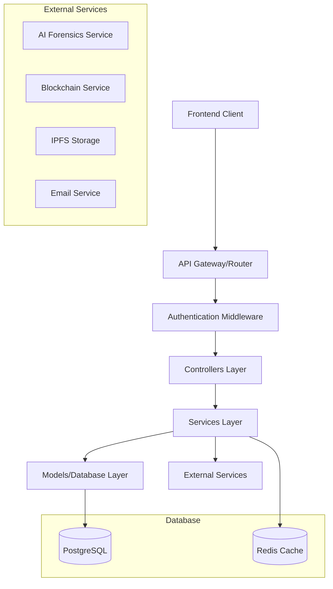

# Design Document

## Overview

The Express.js backend implementation will provide a comprehensive RESTful API for the NeoVerify document verification system. The architecture follows a layered approach with clear separation of concerns, implementing authentication, document management, user profiles, organization management, and integration with external verification services.

## Architecture

### High-Level Architecture



### Technology Stack

- **Runtime**: Node.js with TypeScript
- **Framework**: Express.js 5.x
- **Database**: PostgreSQL with Sequelize ORM
- **Caching**: Redis for session management and caching
- **Authentication**: JWT with refresh tokens, TOTP for MFA
- **File Storage**: Local filesystem with IPFS integration
- **Documentation**: Swagger/OpenAPI 3.0
- **Testing**: Jest with Supertest
- **Logging**: Winston with structured logging

## Components and Interfaces

### 1. Application Entry Point

**File Structure:**
```
src/
├── app.ts              # Express app configuration
├── server.ts           # Server startup and configuration
└── config/
    ├── database.ts     # Database configuration
    ├── redis.ts        # Redis configuration
    ├── swagger.ts      # API documentation setup
    └── index.ts        # Centralized config exports
```

**App Configuration:**
- CORS setup with environment-specific origins
- Security middleware (Helmet, rate limiting)
- Request parsing and validation
- Error handling middleware
- API documentation endpoint

### 2. Authentication System

**Components:**
- JWT token generation and validation
- Refresh token rotation
- TOTP-based MFA implementation
- Password hashing with bcrypt
- Session management with Redis

**Endpoints:**
```
POST /api/auth/register
POST /api/auth/login
POST /api/auth/refresh
POST /api/auth/logout
POST /api/auth/mfa/setup
POST /api/auth/mfa/verify
POST /api/auth/password/reset
POST /api/auth/password/change
```

### 3. Document Management API

**Components:**
- Multipart file upload handling
- File type validation and security scanning
- Metadata extraction and storage
- Document versioning system
- Soft deletion with audit trails

**Endpoints:**
```
POST /api/documents/upload
GET /api/documents
GET /api/documents/:id
PUT /api/documents/:id
DELETE /api/documents/:id
GET /api/documents/:id/download
POST /api/documents/:id/verify
GET /api/documents/:id/verification-status
```

### 4. User Profile Management

**Components:**
- Profile information CRUD operations
- Notification preferences management
- Verification preferences configuration
- Account security settings

**Endpoints:**
```
GET /api/profile
PUT /api/profile
GET /api/profile/preferences
PUT /api/profile/preferences
GET /api/profile/notifications
PUT /api/profile/notifications
GET /api/profile/security
PUT /api/profile/security
```

### 5. Organization Management

**Components:**
- Organization CRUD operations
- User invitation system
- Role-based access control
- Organization settings management

**Endpoints:**
```
GET /api/organizations/:id
PUT /api/organizations/:id
GET /api/organizations/:id/users
POST /api/organizations/:id/users/invite
PUT /api/organizations/:id/users/:userId/role
DELETE /api/organizations/:id/users/:userId
GET /api/organizations/:id/settings
PUT /api/organizations/:id/settings
```

### 6. Verification Engine Integration

**Components:**
- AI forensics service integration
- Blockchain service communication
- IPFS storage integration
- Verification status tracking
- Webhook handling for async results

**Endpoints:**
```
POST /api/verification/start
GET /api/verification/:id/status
POST /api/verification/webhook/ai-forensics
POST /api/verification/webhook/blockchain
GET /api/verification/:id/results
```

## Data Models

### User Model
```typescript
interface User {
  id: string;
  email: string;
  password: string;
  firstName: string;
  lastName: string;
  isEmailVerified: boolean;
  mfaEnabled: boolean;
  mfaSecret?: string;
  organizationId?: string;
  role: UserRole;
  preferences: UserPreferences;
  createdAt: Date;
  updatedAt: Date;
  deletedAt?: Date;
}
```

### Document Model
```typescript
interface Document {
  id: string;
  userId: string;
  organizationId?: string;
  filename: string;
  originalName: string;
  mimeType: string;
  size: number;
  hash: string;
  ipfsHash?: string;
  metadata: DocumentMetadata;
  verificationStatus: VerificationStatus;
  verificationResults?: VerificationResults;
  createdAt: Date;
  updatedAt: Date;
  deletedAt?: Date;
}
```

### Organization Model
```typescript
interface Organization {
  id: string;
  name: string;
  domain: string;
  settings: OrganizationSettings;
  subscriptionTier: SubscriptionTier;
  createdAt: Date;
  updatedAt: Date;
}
```

### Verification Model
```typescript
interface Verification {
  id: string;
  documentId: string;
  userId: string;
  status: VerificationStatus;
  aiForensicsJobId?: string;
  blockchainTxHash?: string;
  results: VerificationResults;
  startedAt: Date;
  completedAt?: Date;
}
```

## Error Handling

### Error Response Format
```typescript
interface ApiError {
  success: false;
  error: {
    code: string;
    message: string;
    details?: any;
    timestamp: string;
    requestId: string;
  };
}
```

### Error Categories
- **Validation Errors** (400): Input validation failures
- **Authentication Errors** (401): Invalid or missing authentication
- **Authorization Errors** (403): Insufficient permissions
- **Not Found Errors** (404): Resource not found
- **Conflict Errors** (409): Resource conflicts
- **Rate Limit Errors** (429): Too many requests
- **Server Errors** (500): Internal server errors
- **Service Unavailable** (503): External service failures

### Error Handling Middleware
- Global error handler with structured logging
- Validation error formatter
- Database error handler
- External service error handler
- Rate limiting with Redis

## Testing Strategy

### Unit Testing
- Controller unit tests with mocked dependencies
- Service layer unit tests
- Model validation tests
- Utility function tests
- Middleware unit tests

### Integration Testing
- API endpoint integration tests
- Database integration tests
- External service integration tests
- Authentication flow tests
- File upload/download tests

### End-to-End Testing
- Complete user registration and login flows
- Document upload and verification workflows
- Organization management scenarios
- Error handling and edge cases

### Test Structure
```
tests/
├── unit/
│   ├── controllers/
│   ├── services/
│   ├── models/
│   └── middleware/
├── integration/
│   ├── auth/
│   ├── documents/
│   ├── profile/
│   └── organization/
└── e2e/
    ├── user-flows/
    └── admin-flows/
```

### Testing Tools
- **Jest**: Test framework and assertion library
- **Supertest**: HTTP assertion library for API testing
- **Factory Bot**: Test data generation
- **Nock**: HTTP mocking for external services
- **Test Containers**: Database testing with Docker

## Security Considerations

### Authentication & Authorization
- JWT tokens with short expiration times
- Refresh token rotation
- TOTP-based MFA implementation
- Role-based access control (RBAC)
- API key authentication for service-to-service communication

### Data Protection
- Password hashing with bcrypt (12+ rounds)
- Sensitive data encryption at rest
- PII data handling compliance
- Secure file upload validation
- SQL injection prevention with parameterized queries

### API Security
- Rate limiting per user/IP
- CORS configuration
- Security headers (Helmet.js)
- Input validation and sanitization
- File type and size validation
- Request size limits

### Infrastructure Security
- Environment variable management
- Database connection security
- Redis security configuration
- HTTPS enforcement
- Security monitoring and logging

## Performance Optimization

### Caching Strategy
- Redis caching for frequently accessed data
- User session caching
- API response caching for static data
- Database query result caching

### Database Optimization
- Proper indexing strategy
- Query optimization
- Connection pooling
- Read replicas for scaling
- Database query monitoring

### File Handling
- Streaming file uploads/downloads
- File compression
- CDN integration for file serving
- Background processing for large files

### API Performance
- Response compression (gzip)
- Pagination for large datasets
- Lazy loading strategies
- Background job processing
- API response time monitoring